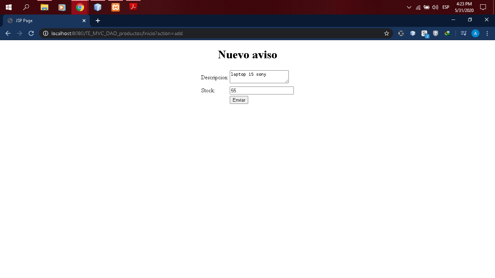
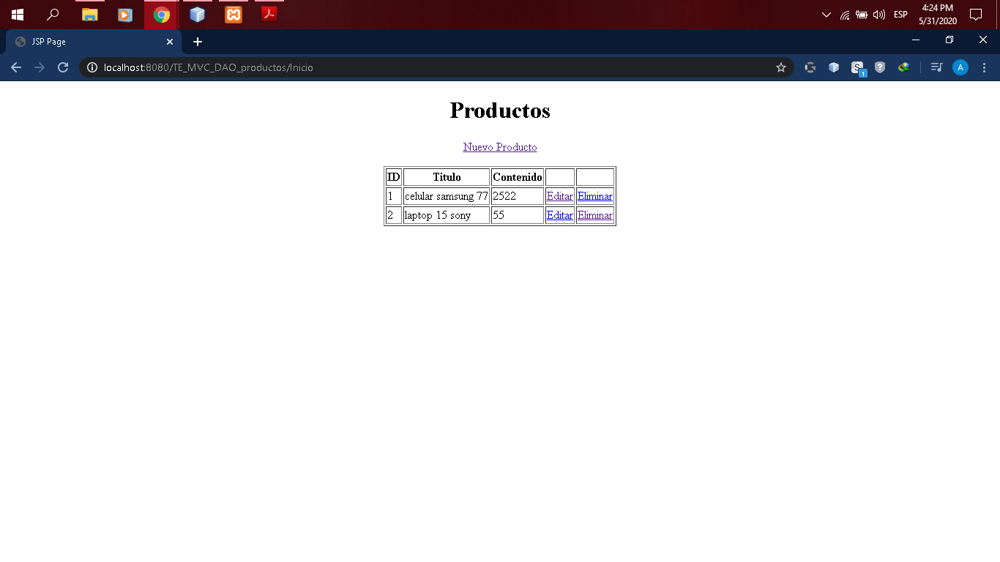
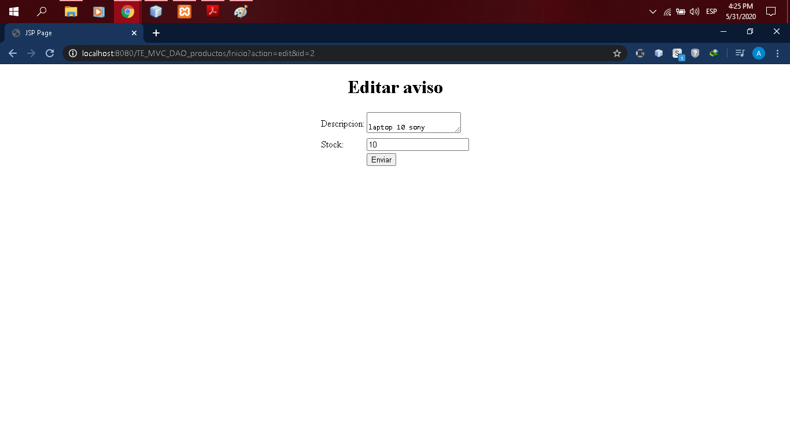
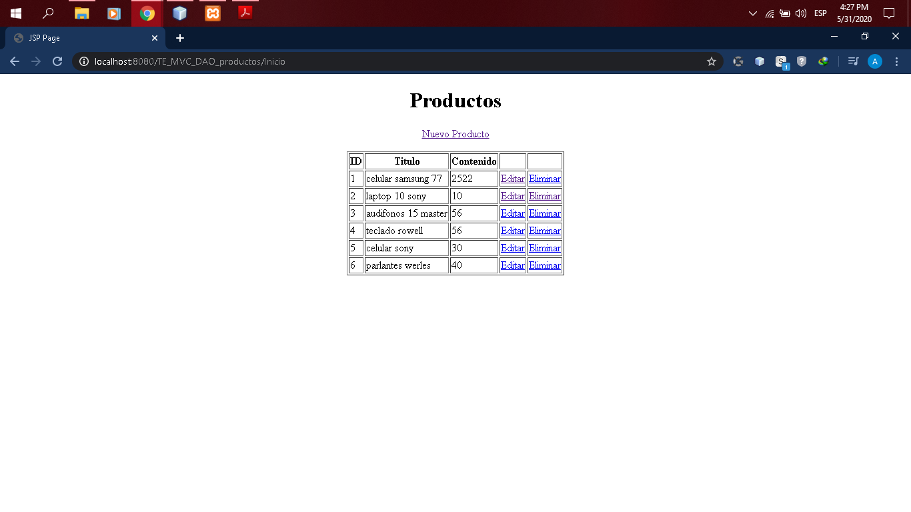
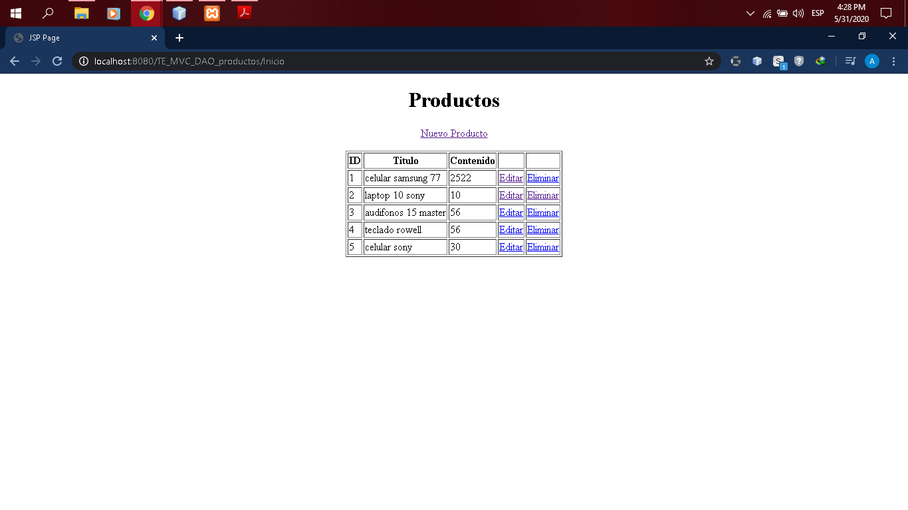

# Mi Aplicacion en netbeans
------------------   PRACTICA 5 ---------------------------------

Patrón de diseño DAO
Crear una aplicación Web para gestionar los productos de un almacén.

Crear las operaciones CRUD para la tabla correspondiente utilizando el patrón DAO

Realizado por : Adalid Roman Gutierrez Flores
CARRERA: INGENIERIA DE SISTEMAS
MATERIA : TECNOLOGIAS EMERGENTES II

BASE DE DATOS:
bd_almacen.sql

Imagenes :

